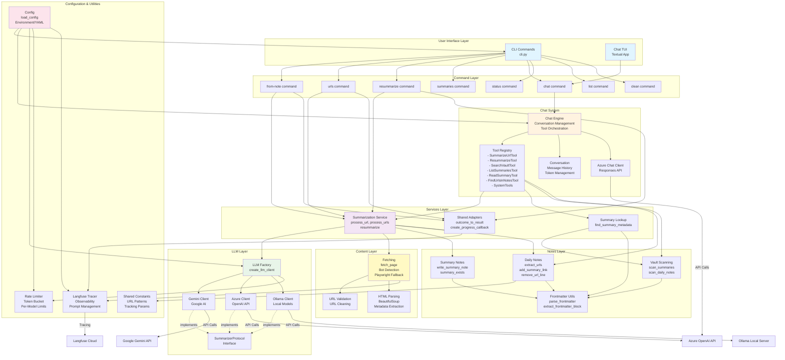

# System Architecture

This document provides a comprehensive overview of the Obsidian Link Summarizer architecture.

## High-Level Architecture



## Architecture Layers

### 1. User Interface Layer

Two primary interfaces for interacting with the system:

- **CLI (`cli.py`)**: Traditional command-line interface with subcommands for different operations
- **Chat TUI**: Interactive conversational interface built with Textual framework

### 2. Command Layer

Individual command implementations that orchestrate the workflow:

- **from-note**: Process URLs from daily notes
- **urls**: Process specific URLs directly
- **resummarize**: Re-generate summaries for existing notes
- **summaries**: Display summary statistics and reports
- **chat**: Launch the interactive chat TUI
- **status**: Show rate limit and system status
- **list**: List daily notes with URLs
- **clean**: Clean up whitespace in notes

### 3. Services Layer (`summarize_links/services/`)

**NEW**: Centralized business logic shared between CLI and Chat:

- **`summarization.py`**: Core summarization workflows
  - `process_url()`: Process a single URL
  - `process_urls()`: Batch process multiple URLs
  - `resummarize()`: Re-summarize existing content
  - Returns structured `ProcessOutcome` objects

- **`summaries.py`**: Summary metadata lookup
  - `find_summary_metadata()`: Find summaries by URL or slug

- **`shared.py`**: Adapter utilities
  - Convert between service outcomes and CLI result tuples
  - Create progress callbacks for different UIs

### 4. Chat System (`summarize_links/chat/`)

**NEW**: Conversational AI interface:

- **`engine.py`**: Chat Engine
  - Manages conversation state
  - Orchestrates tool calling
  - Handles streaming responses
  - Session-level Langfuse tracing

- **`azure_client.py`**: Azure OpenAI Responses API client
  - Native function calling support
  - Conversation state via `previous_response_id`
  - Streaming support

- **`conversation.py`**: Message history management
  - Token counting and context window management
  - Message trimming to stay within limits
  - Session persistence

- **`tools/`**: Tool implementations
  - `SummarizeUrlTool`: Summarize URLs via chat
  - `ResummarizeTool`: Re-summarize existing notes
  - `SearchVaultTool`: Search summaries by keyword/tag
  - `ListSummariesTool`: List summaries with filtering
  - `ReadSummaryTool`: Read specific summary content
  - `FindUrlsInNotesTool`: Find URLs in daily notes
  - System tools (status, vault statistics)

### 5. LLM Layer (`summarize_links/llm/`)

Multi-provider abstraction for AI models:

- **`factory.py`**: LLM Factory
  - Creates appropriate client based on configuration
  - Supports Google Gemini, Azure OpenAI, and Ollama

- **`base.py`**: Base classes and protocols
  - `SummarizerProtocol`: Interface for all LLM clients
  - `LazyClientMixin`: Lazy initialization pattern

- **Provider Clients**:
  - `gemini.py`: Google Gemini API
  - `azure.py`: Azure OpenAI Completions API (for summarization)
  - `ollama.py`: Local Ollama models

### 6. Content Layer (`summarize_links/extract/`)

Web content fetching and parsing:

- **`fetching.py`**: HTTP fetching with retries
  - Bot detection handling
  - Playwright fallback for JavaScript-heavy sites
  - User-agent rotation

- **`html_parsing.py`**: HTML content extraction
  - **BeautifulSoup** for safe HTML parsing (security fix)
  - Metadata extraction (title, author, date, description)

- **`validation.py`**: URL validation and cleaning
  - Remove tracking parameters
  - Normalize URLs

### 7. Notes Layer (`summarize_links/notes/`)

Obsidian vault operations:

- **`daily_notes.py`**: Daily note management
  - Extract URLs from markdown
  - Add summary links
  - Remove processed URLs

- **`summaries.py`**: Summary note operations
  - Write summary notes with frontmatter
  - Check if summary exists
  - Generate slugs from titles

- **`scanning.py`**: Vault scanning
  - Scan all summaries
  - Scan daily notes for URLs
  - Extract metadata from frontmatter

### 8. Configuration & Utilities

Supporting infrastructure:

- **`config.py`**: Configuration management
  - Environment variables
  - YAML config files
  - Defaults and validation

- **`rate_limiter.py`**: API rate limiting
  - Token bucket algorithm
  - Per-model limits
  - RPM, TPM, and daily limits

- **`langfuse_tracer.py`**: LLM observability
  - Trace generation calls
  - Prompt management
  - Session-level tracing for chat

- **`utils/frontmatter.py`**: YAML frontmatter utilities
  - Extract frontmatter blocks
  - Parse YAML safely
  - Get individual fields

- **`constants.py`**: Shared constants
  - URL regex patterns
  - Tracking parameter lists
  - Common TLDs

## Key Design Patterns

### 1. Service Layer Pattern

The services layer provides a clean separation between UI (CLI/Chat) and business logic:

```python
# CLI calls service
outcome = summarization.process_url(url_ctx, config, client)
if outcome.success:
    print(outcome.message)

# Chat tool calls same service
outcome = summarization.process_url(url_ctx, config, client)
return ToolResult(
    success=outcome.success,
    message=outcome.message,
    data={"slug": outcome.slug}
)
```

### 2. Factory Pattern

LLM client creation based on configuration:

```python
client = create_llm_client(config)
# Returns GeminiClient, AzureClient, or OllamaClient
# All implement SummarizerProtocol
```

### 3. Protocol-Based Abstraction

Interface for LLM clients enables provider swapping:

```python
class SummarizerProtocol(Protocol):
    def summarize(self, content: str, url: str) -> str: ...
    def summarize_with_metadata(self, ...) -> SummaryResult: ...
```

### 4. Lazy Initialization Mixin

Consistent client initialization pattern:

```python
class MyClient(LazyClientMixin[ClientType]):
    def _get_client(self) -> ClientType:
        return self._get_or_create_client(
            lambda: ClientType(api_key=self._api_key),
            "MyClient"
        )
```

### 5. Tool Registry Pattern

Extensible tool system for chat:

```python
registry = ToolRegistry()
registry.register(SummarizeUrlTool())
registry.register(SearchVaultTool())

# Execute tool by name
result = registry.execute("summarize_url", config, url="...")
```

## Data Flow

### URL Summarization Flow

```
User Input (URL)
    ↓
Command Layer (from-note/urls)
    ↓
Services Layer (process_url)
    ↓
├─→ Fetch Content (extract/fetching.py)
│   └─→ Playwright Fallback (if bot detected)
    ↓
├─→ Create LLM Client (llm/factory.py)
│   └─→ Select Provider (Gemini/Azure/Ollama)
    ↓
├─→ Generate Summary (LLM Provider)
│   └─→ Trace with Langfuse
    ↓
├─→ Write Summary Note (notes/summaries.py)
│   └─→ Add Frontmatter
    ↓
└─→ Update Daily Note (notes/daily_notes.py)
    ├─→ Add Summary Link
    └─→ Remove Original URL

Return ProcessOutcome
```

### Chat Flow

```
User Message
    ↓
Chat TUI (tui.py)
    ↓
Chat Engine (engine.py)
    ↓
Azure Chat Client (Responses API)
    ↓
├─→ LLM processes message
│   └─→ Returns function calls
    ↓
Tool Registry
    ↓
├─→ Tool calls Services Layer
│   └─→ Same flow as CLI commands
    ↓
Submit Tool Results
    ↓
LLM generates response
    ↓
Display to User (with streaming)
```

## External Dependencies

- **Google Gemini API**: Cloud AI for summarization
- **Azure OpenAI API**: Enterprise AI (both summarization and chat)
- **Ollama**: Local open-source models
- **Langfuse Cloud**: LLM observability and prompt management
- **Playwright**: Browser automation for bot-blocked sites

## Security Features

1. **BeautifulSoup HTML Parsing**: Safe HTML parsing instead of regex (prevents XSS)
2. **URL Validation**: Remove tracking parameters, sanitize inputs
3. **API Key Redaction**: Sensitive data not logged
4. **Rate Limiting**: Prevent API abuse
5. **Path Validation**: Prevent directory traversal

## Configuration Hierarchy

1. CLI arguments (highest priority)
2. Environment variables
3. Vault YAML config (`.summarizer-config.yaml`)
4. Default values (lowest priority)

## Testing Strategy

- **Unit Tests**: Individual functions with mocked dependencies
- **Integration Tests**: End-to-end flows with real APIs (marked with `@pytest.mark.integration`)
- **Coverage Target**: 95%+ (currently 85%)
- **Test Files**: Mirror source structure (`tests/test_*.py`)

## Future Improvements

See detailed plans in:
- [`tech-debt-cleanup-plan.md`](tech-debt-cleanup-plan.md)
- [`commands-chat-unification-plan.md`](commands-chat-unification-plan.md)
- [`processor-deprecation-plan.md`](processor-deprecation-plan.md)
